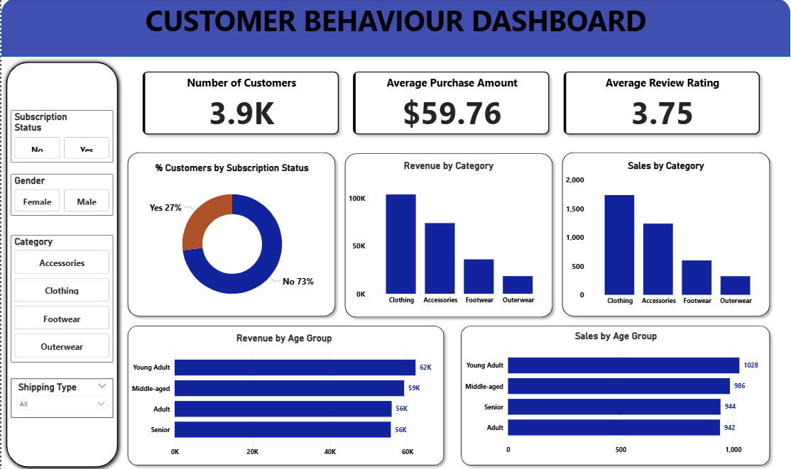

# Customer Behaviour Analysis Project

## 1. Project Overview
This project focuses on analyzing customer purchasing behaviour to extract business insights related to revenue, customer segmentation, product performance, and purchasing patterns.  
The workflow integrates Python for data processing, MySQL for structured data storage and querying, and Power BI for interactive dashboard visualization.

---

## 2. Dataset Overview
The dataset contains customer transaction and behavioural information, including:
- Customer demographics (e.g., age group, location)
- Purchase history and frequency
- Product categories and items
- Payment methods
- Customer subscription status
- Customer review ratings

The data is used to analyze revenue contribution, purchasing trends, customer segmentation, and product performance.

---

## 3. Python (Data Processing & ETL)
Python is used for:
- Loading and preprocessing raw customer data
- Data cleaning and transformation
- Preparing structured datasets for analysis
- Connecting and loading cleaned data into a MySQL database using SQLAlchemy

Key libraries:
- pandas
- sqlalchemy
- python-dotenv

---

## 4. MySQL (Data Storage & Analysis)
MySQL is used to:
- Store structured and cleaned datasets
- Perform analytical queries
- Generate insights such as:
  - Top revenue-generating product categories
  - Customer segmentation (New, Returning, Loyal)
  - Purchase frequency vs spending behaviour
  - Revenue by location
  - Payment method analysis
  - Top-selling products

---

## 5. Power BI (Dashboard & Visualization)
Power BI is used to:
- Build interactive dashboards
- Visualize key business metrics
- Support data-driven decision-making
- Provide insights into customer behaviour, revenue trends, and product performance

---

## 6. Dashboard Preview

---

## ⚙️ Tech Stack
- Python
- MySQL
- Power BI
- Pandas
- SQLAlchemy